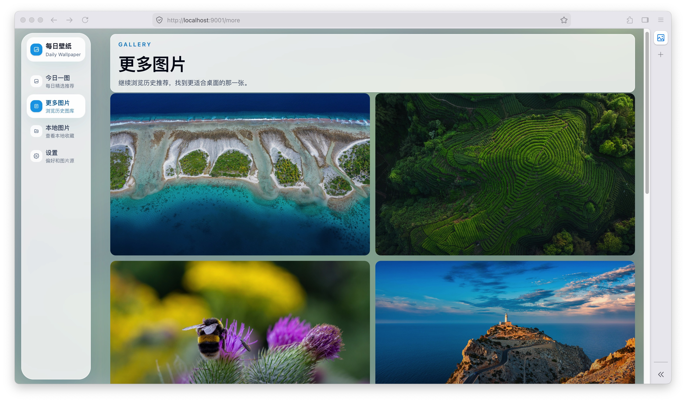

# daily-wallpaper

> 🐟每天自动切换桌面壁纸

- [x] 支持bing壁纸
- [x] 支持unsplash壁纸
- [x] 支持Windows和Mac端壁纸切换
- [x] 壁纸自动切换
- [x] 部分配置支持网页端保存
- [ ] 支持更多壁纸源的切换

🚧 部分功能完成

## 截图



## 构建

### 1.Windows

```powershell
.\build-windows.ps1
```

### 2.Mac

```sh
./build-mac.sh
```

若你曾使用旧版本开启「开机自启」，升级后首次开启自启时会自动清理旧的会话登录项；若仍出现重复启动，可在「系统设置 → 一般 → 登录打开的项目」中移除多余的旧条目。